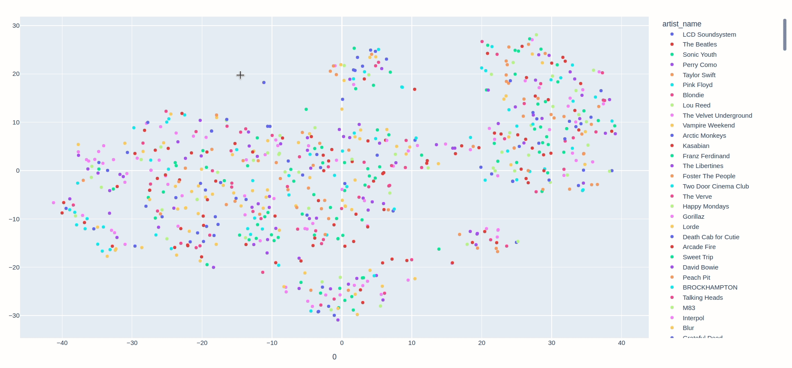
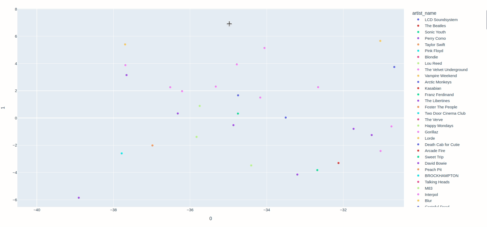
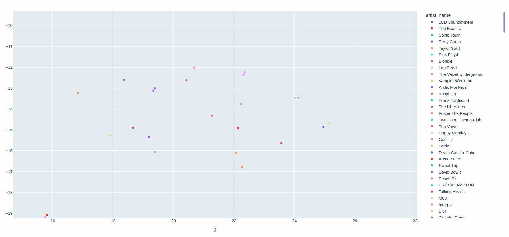
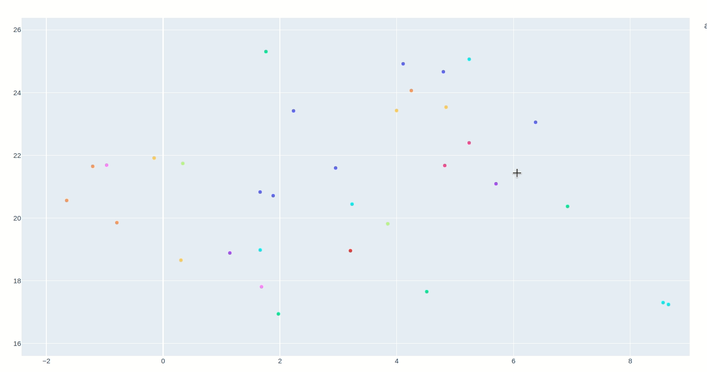

# raphael

this project is an (ongoing) attempt to visualise all my liked spotify songs. generated plots available [here](assets/plot.html).
 

scatter plot of all 727 songs 

 

## so far:
- downloaded the metadata of all liked songs
- used spotify audio features api to extract acoustic features like `'danceability',
       'energy', 'key', 'loudness', 'mode', 'speechiness', 'acousticness',
       'instrumentalness', 'liveness', 'valence',` and `'tempo'`
- used t-SNE for dimensionality reduction and plotly for user friendly visualisation

## findings:
while embeddings are quite simple, some observations are interesting

bob dylan songs grouped together

 

electronic music? VU definitely being an anomaly 

 

 rap/hip-hop 

## to dos:
- attempt to generate better embeddings (auto encoders?)
- model the song genre
- look for other relevant features